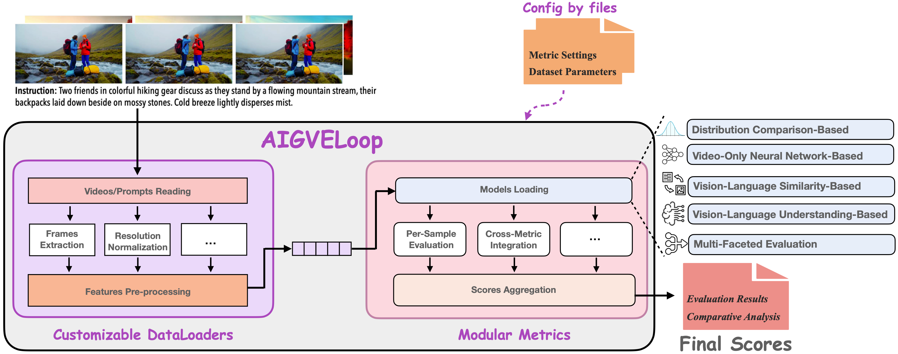

# What is `AIGVE`?

`AIGVE` (**AI Generated Video Evaluation Toolkit**) provides a **comprehensive** and **structured** evaluation framework for assessing AI-generated video quality developed by the [IFM Lab](https://www.ifmlab.org/). It integrates multiple evaluation metrics, covering diverse aspects of video evaluation, including neural-network-based assessment, distribution comparison, vision-language alignment, and multi-faceted analysis.

* **Official Website**: [https://www.aigve.org/](https://www.aigve.org/)
* **Github Repository**: [https://github.com/ShaneXiangH/AIGVE_Tool](https://github.com/ShaneXiangH/AIGVE_Tool)
* **PyPI Package**: [https://pypi.org/project/aigve/](https://pypi.org/project/aigve/)
* **AIGVE-Bench Full Dataset** [https://huggingface.co/datasets/xiaoliux/AIGVE-Bench](https://huggingface.co/datasets/xiaoliux/AIGVE-Bench)
* **IFM Lab** [https://www.ifmlab.org/](https://www.ifmlab.org/)




## Library Organization

| Components                                                                  | Descriptions                                                          |
|:----------------------------------------------------------------------------|:----------------------------------------------------------------------|
| [`aigve`](https://www.aigve.org/documentations/aigve/)                      | The library for assessing AI-generated video quality                  |
| [`aigve.configs`](https://www.aigve.org/documentations/configs/)              | a library for parameter configuration and management                  |
| [`aigve.core`](https://www.aigve.org/documentations/core/)                  | a library for video evaluation process design                         |
| [`aigve.datasets`](https://www.aigve.org/documentations/datasets/)          | a library for dataset loading design                                  |
| [`aigve.metrics`](https://www.aigve.org/documentations/metrics/)            | a library for video evaluation metrics design and building            |
| [`aigve.utils`](https://www.aigve.org/documentations/utils/)                | a library for utility function definition                             |


## Evaluation Metrics Zoo

###  **Distribution Comparison-Based Evaluation Metrics**

<!-- <h2> <strong>Distribution Comparison-Based Evaluation Metrics</strong></h2> -->

These metrics assess the quality of generated videos by comparing the distribution of real and generated samples.

- ✅ **[FID](aigve/configs/fid.py)**: Frechet Inception Distance (FID) quantifies the similarity between real and generated video feature distributions by measuring the Wasserstein-2 distance.
- ✅ **[FVD](aigve/configs/fvd.p)**: Frechet Video Distance (FVD) extends the FID approach to video domain by leveraging spatio-temporal features extracted from action recognition networks.
- ✅ **[IS](aigve/configs/is_score.py)**: Inception Score (IS) evaluates both the quality and diversity of generated content by analyzing conditional label distributions.

---

### **Video-only Neural Network-Based Evaluation Metrics**
These metrics leverage deep learning models to assess AI-generated video quality based on learned representations.

- ✅ **[GSTVQA](aigve/configs/gstvqa.py)**: Generalized Spatio-Temporal VQA (GSTVQA) employs graph-based spatio-temporal analysis to assess video quality.
- ✅ **[SimpleVQA](aigve/configs/simplevqa.py)**: Simple Video Quality Assessment (Simple-VQA) utilizes deep learning features for no-reference video quality assessment.
- ✅ **[LightVQA+](aigve/configs/lightvqa_plus.py)**: Light Video Quality Assessment Plus (Light-VQA+) incorporates exposure quality guidance to evaluate video quality.

---

### **Vision-Language Similarity-Based Evaluation Metrics**
These metrics evaluate **alignment, similarity, and coherence** between visual and textual representations, often using embeddings from models like CLIP and BLIP.

- ✅ **[CLIPSim](aigve/configs/clipsim.py)**: CLIP Similarity (CLIPSim) leverages CLIP embeddings to measure semantic similarity between videos and text.
- ✅ **[CLIPTemp](aigve/configs/cliptemp.py)**: CLIP Temporal (CLIPTemp) extends CLIPSim by incorporating temporal consistency assessment.
- ✅ **[BLIPSim](aigve/configs/blipsim.py)**: Bootstrapped Language-Image Pre-training Similarity (BLIPSim) uses advanced pre-training techniques to improve video-text alignment evaluation.
- ✅ **[Pickscore](aigve/configs/pickscore.py)**: PickScore incorporates human preference data to provide more perceptually aligned measurement of video-text matching.

---

### **Vision-Language Understanding-Based Evaluation Metrics**
These metrics assess **higher-level understanding, reasoning, and factual consistency** in vision-language models.

- ✅ **[VIEScore](aigve/configs/viescore.py)**: Video Information Evaluation Score (VIEScore) provides explainable assessments of conditional image synthesis.
- ✅ **[TIFA](aigve/configs/tifa.py)**: Text-Image Faithfulness Assessment (TIFA) employs question-answering techniques to evaluate text-to-image alignment.
- ✅ **[DSG](aigve/configs/dsg.py)**: Davidsonian Scene Graph (DSG) improves fine-grained evaluation reliability through advanced scene graph representations.

---

### **Multi-Faceted Evaluation Metrics**
These metrics integrate **structured, multi-dimensional assessments** to provide a **holistic benchmarking framework** for AI-generated videos.

- ✅ **[VideoPhy](aigve/configs/videophy.py)**: Video Physics Evaluation (VideoPhy) specifically assesses the physical plausibility of generated videos.
- ✅ **[VideoScore](aigve/configs/viescore.py)**: Video Score (VideoScore) simulates fine-grained human feedback across multiple evaluation dimensions.
- ✅ **[VBench](aigve/configs/vbench.py)**: VBench provides a comprehensive benchmark by combining multiple aspects such as consistency, realism, and alignment into a unified scoring system.
---


## Key Features
- **Multi-Dimensional Evaluation**: Covers video coherence, physics, and benchmarking.
- **Open-Source & Customizable**: Designed for easy integration.
- **Cutting-Edge AI Assessment**: Supports various AI-generated video tasks.


## Built-in Dataset:
1. [Toy dataset](aigve/data/toy) 
2. [AIGVE-Bench toy](aigve/data/AIGVE_Bench_toy)
3. [AIGVE-Bench]([aigve/data/AIGVE_Bench_toy](https://huggingface.co/datasets/xiaoliux/AIGVE-Bench))

## Installation

The `aigve` library has been published at both [PyPI](https://pypi.org/project/aigve/) and the [project github repository](https://github.com/ShaneXiangH/AIGVE_Tool).


### Install from PyPI

To install `aigve` from [PyPI](https://pypi.org/project/aigve/), use the following command:

```shell
pip install aigve
```


### Install from Source Code

You can also install `aigve` from the source code, which has been released at the 
[project github repository](https://github.com/ShaneXiangH/AIGVE_Tool). 

You can download the public repository either from the project github webpage or via the following command:
```shell
git clone https://github.com/ShaneXiangH/AIGVE_Tool.git
```

Please check the [installation page](https://www.aigve.org/guides/installation/#dependency-packages) for dependency packages.

## Environment

```
conda env remove --name aigve
conda env create -f environment.yml
conda activate aigve
# Canonical fix for Torch/Torchaudio conflicts (GPU, CUDA 11.8):
conda install -n aigve -y -c pytorch -c nvidia "pytorch=2.1.0" "torchvision=0.16.0" "torchaudio=2.1.0" "pytorch-cuda=11.8"
```

### Environment setup via `setup_env.sh` (recommended)

The helper script automates environment creation and installs a GPU-only PyTorch build (CUDA 11.8). It also adds ONNX/protobuf and filters/installs the rest of requirements without breaking the conda Torch install. CPU-only installation is disabled.

Basic usages:

- **GPU (enforced)**
  ```bash
  bash setup_env.sh
  ```
- **Explicit env name (default is 'aigve')**
  ```bash
  bash setup_env.sh --env-name aigve
  ```
- **With NLP extras (install transformers and compatible tokenizers)**
  ```bash
  bash setup_env.sh --with-nlp
  ```

Notes:
- `--cpu` is disabled and will exit with an error. This project requires a GPU-enabled PyTorch build.

What the script does:
- Re-creates the env from `environment.yml`.
- Uninstalls any pip-installed Torch packages, then installs conda Torch: `pytorch=2.1.0` + `torchvision=0.16.0` + `torchaudio=2.1.0` with `pytorch-cuda=11.8` (GPU-only enforced).
- Installs `onnx==1.14.1` and `protobuf>=4.23.4,<4.24`.
- Installs `charset-normalizer` and `opencv-python-headless`.
- Installs remaining requirements with `--no-deps` while filtering out torch pins.
- If `--with-nlp` is set, installs `transformers>=4.44.0` and `tokenizers>=0.20,<0.21`; if `transformers` is already present, ensures a compatible `tokenizers` to avoid ImportErrors.
- Prints sanity checks for Torch/ONNX and, when installed, Transformers/Tokenizers.

#### Troubleshooting

- __RequestsDependencyWarning: character detection dependency__
  If you see:
  `RequestsDependencyWarning: Unable to find acceptable character detection dependency (chardet or charset_normalizer).`
  install one of them into the env:
  ```bash
  conda install -n aigve -y -c conda-forge charset-normalizer
  # or
  pip install charset-normalizer chardet
  ```
  Note: `setup_env.sh` already installs `charset-normalizer` and `chardet`. Run it if you have not.

### Import and Registry Best Practices

- __Avoid circular imports in `aigve.core`__
  - Inside `aigve/core/*.py`, import registries via relative imports, e.g. `from .registry import MODELS, LOOPS` instead of `from core import MODELS`.
  - This prevents `ImportError: cannot import name 'MODELS' from partially initialized module 'core'` when the legacy `core` shim points back to `aigve.core`.

- __Legacy shims for backward compatibility__
  - `core/` and `core/registry.py` are lightweight shims that re-export `aigve.core` and `aigve.core.registry` so old imports like `from core.registry import METRICS` continue to work.
  - When running standalone scripts (e.g., `scripts/prepare_annotations.py`) without installing the package, ensure only the project root is added to `sys.path` (not the `aigve/` folder) to avoid duplicate package imports.
  - If you need legacy names, you can alias at runtime:
    ```python
    import importlib, sys
    sys.modules.setdefault("core", importlib.import_module("aigve.core"))
    sys.modules.setdefault("metrics", importlib.import_module("aigve.metrics"))
    ```

- __Lazy-load optional metrics to avoid heavy deps (e.g., flash-attn)__
  - `aigve/metrics/__init__.py` does not eagerly import all subpackages.
  - Import metric implementations explicitly as needed, e.g.:
    ```python
    from aigve.metrics.video_quality_assessment.distribution_based.fid_metric import FIDScore
    ```
  - This avoids importing optional dependencies unless those metrics are requested.

## Run:
``
python main.py {metric_config_file}.py
``

Take Examples:

```
rm -rf ~/.cache
cd AIGVE_Tool/aigve
```

For GSTVQA:
``
python main_aigve.py AIGVE_Tool/aigve/configs/gstvqa.py --work-dir ./output
``

For SimpleVQA:
``
python main_aigve.py AIGVE_Tool/aigve/configs/simplevqa.py --work-dir ./output
``

For LightVQAPlus:
``
python main_aigve.py AIGVE_Tool/aigve/configs/lightvqa_plus.py --work-dir ./output
``

For CLIPSim:
``
python main_aigve.py AIGVE_Tool/aigve/configs/clipsim.py --work-dir ./output
``

For VideoPhy:
``
python main_aigve.py AIGVE_Tool/aigve/configs/clipsim.py --work-dir ./output
``

## Run the API locally (without Docker)

Run the FastAPI server on your host using the GPU-enabled conda environment.

### Prerequisites
- NVIDIA driver installed on host; verify with `nvidia-smi`.
- Conda (Anaconda/Miniconda/Mamba) installed.
- GPU-only PyTorch build (CUDA 11.8) in the `aigve` env (use the helper below).

### Create and activate the environment (GPU-only)
```bash
# From repo root
conda env remove --name aigve -y || true
conda env create -f environment.yml
conda activate aigve

# Enforce GPU-only Torch 2.1 + CUDA 11.8 and install extras
bash setup_env.sh               # add --with-nlp if you need transformers
```

### Verify the GPU build
```bash
python - <<'PY'
import torch, json
print(json.dumps({
  'torch': torch.__version__,
  'cuda_available': torch.cuda.is_available(),
  'cuda_version': getattr(torch.version, 'cuda', None),
  'device_count': torch.cuda.device_count() if torch.cuda.is_available() else 0,
}, indent=2))
PY
```

If `cuda_available` is false, ensure the env has a CUDA build of torch:
```bash
conda install -n aigve -y -c pytorch -c nvidia \
  "pytorch=2.1.0" "torchvision=0.16.0" "torchaudio=2.1.0" "pytorch-cuda=11.8"
```

### Start the API
```bash
# Default: port 2200
uvicorn server.main:app --host 0.0.0.0 --port 2200
# Optional: add workers/log level
# uvicorn server.main:app --host 0.0.0.0 --port 2200 --workers 2 --log-level info
```

Open the docs: http://localhost:2200/docs

### Call the API
- Health:
  ```bash
  curl http://localhost:2200/healthz
  ```
- Example run (distribution metrics):
  ```bash
  curl -X POST http://localhost:2200/run \
    -H 'Content-Type: application/json' \
    -d '{
      "input_dir": "/path/to/mixed_videos",
      "stage_dataset": "/path/to/staged",
      "compute": true,
      "categories": "distribution_based",
      "max_seconds": 8,
      "fps": 25
    }'
  ```

### Troubleshooting (local)
- CUDA visible via `nvidia-smi` but `cuda_available=false`:
  - Confirm conda Torch is a CUDA build: `conda list | grep -E "pytorch|pytorch-cuda"` (should show `pytorch-cuda 11.8`).
  - Reinstall with the CUDA 11.8 instructions above.
- No devices in PyTorch but you have multiple GPUs: make sure you didn't mask them; avoid an empty `CUDA_VISIBLE_DEVICES`. You can pick one explicitly:
  ```bash
  export CUDA_VISIBLE_DEVICES=0
  ```
- If FastAPI cannot find the script, ensure you start uvicorn from the repo root so `server/main.py` can resolve `scripts/prepare_annotations.py`.

## Docker

This project ships with a Dockerized, conda-based environment that supports both CLI and REST API usage.

### Prerequisites
- Docker installed
- For GPU support: NVIDIA driver + NVIDIA Container Toolkit (host) and `--gpus all` at runtime

### Build the image
- GPU (default and required):
  ```bash
  docker build --no-cache -t ghcr.io/bmwas/aigve:latest .
  ```

### Run the API server (default, port 2200)
- GPU (required):
  ```bash
  docker run --rm --gpus all -p 2200:2200 \
    -v "$PWD/data":/app/data -v "$PWD/out":/app/out \
    ghcr.io/bmwas/aigve:latest
  # Open docs: http://localhost:2200/docs
  ```
- Custom port:
  ```bash
  docker run --rm -e PORT=9000 -p 9000:9000 ghcr.io/bmwas/aigve:latest
  ```
- Extra Uvicorn options (workers, log level):
  ```bash
  docker run --rm --gpus all -p 2200:2200 ghcr.io/bmwas/aigve:latest api --workers 2 --log-level info
  ```

- GPU requirement behavior:
  - By default, the container enforces GPU availability and exits if CUDA is not available.
  - To bypass for debugging (not recommended): set `-e REQUIRE_GPU=0` when running the container.
  Notes:
  - The container logs print a CUDA check JSON at startup (from `torch`), e.g. `{ "cuda_available": true, ... }`.
  - If CUDA is not available (e.g., missing `--gpus all` or drivers/toolkit), the container exits with a fatal message unless you explicitly set `REQUIRE_GPU=0`.

### Call the API
- __Health__
  ```bash
  curl http://localhost:2200/healthz
  ```
  Returns JSON including CUDA/Torch info: `torch`, `cuda_available`, `cuda_version`, `device_count`, `torch_error`.
- __Help (CLI flags)__
  ```bash
  curl http://localhost:2200/help
  ```
- __Run prepare + metrics__
  ```bash
  curl -X POST http://localhost:2200/run \
    -H 'Content-Type: application/json' \
    -d '{
      "input_dir": "/app/data",
      "stage_dataset": "/app/out/staged",
      "compute": true,
      "categories": "distribution_based",
      "max_seconds": 8,
      "fps": 25
    }'
  ```
  Notes:
  - Paths must reference mounted container paths (e.g., `/app/data`, `/app/out`).
  - All CLI flags from `scripts/prepare_annotations.py` are exposed as JSON fields. For new/advanced flags, use `extra_args` (array of raw CLI tokens).
  - OpenAPI UI available at `/docs` and `/redoc`.

### Python client (scripts/call_aigve_api.py)

Use the included Python client to call the REST API and run distribution-based metrics (FID/IS/FVD).

- GPU requirement:
  - The server container requires a GPU and will exit if CUDA is unavailable (unless you set `REQUIRE_GPU=0` for debugging).
  - The `--cpu` flag in the client is for legacy/local runs and is ignored/ineffective with the default GPU-enforcing container.

- Start the API container (GPU):
  ```bash
  docker run -d --name aigve --restart unless-stopped \
    --gpus all -p 2200:2200 \
    -v "$PWD/data":/app/data -v "$PWD/out":/app/out \
    ghcr.io/bmwas/aigve:latest
  # Docs: http://localhost:2200/docs
  ```

- Run the client (GPU by default):
  ```bash
  python scripts/call_aigve_api.py
  ```

<!-- CPU-only client mode is not supported by the default server container. -->

- Control duration and base URL:
  ```bash
  python scripts/call_aigve_api.py --max-seconds 8 --fps 25 \
    --base-url http://localhost:2200
  ```

Client defaults (container paths):
- `input_dir=/app/data` (mount your host `./data` to this path)
- `stage_dataset=/app/out/staged` (mount your host `./out` to `/app/out`)

#### Client-only Python environment (no server deps)

Create a lightweight virtualenv for the Python client only (it just needs `requests`).

```bash
# From repo root
python -m venv .venv-aigve-client
source .venv-aigve-client/bin/activate
pip install -r scripts/requirements-client.txt

# Call the API (GPU on server by default; add --cpu to force CPU)
python scripts/call_aigve_api.py --base-url http://localhost:2200
# or
python scripts/call_aigve_api.py --base-url http://<server-ip>:2200 --cpu

# Deactivate when done
deactivate
```

Notes:
- `scripts/requirements-client.txt` is minimal and avoids installing server-side deps (numpy/torch/mmengine, etc.).
- If you see `ModuleNotFoundError: numpy` in outputs, that error is coming from the server container during metric computation, not from this client.

### Run CLI via Docker (no API)
Pass the script flags directly to the container. If arguments are provided and the first one is not `api`, the image runs the CLI instead of the API.

- Example (GPU):
  ```bash
  docker run --rm --gpus all \
    -v "$PWD/data":/app/data -v "$PWD/out":/app/out \
    ghcr.io/bmwas/aigve:latest \
      --input-dir /app/data \
      --stage-dataset /app/out/staged \
      --compute --categories distribution_based \
      --max-seconds 8 --fps 25
  ```

- Show help:
  ```bash
  docker run --rm ghcr.io/bmwas/aigve:latest --help
  ```

### REST API Reference (server/main.py)

This project exposes a FastAPI server that wraps `scripts/prepare_annotations.py`.

- __Start locally (no Docker)__
  ```bash
  # Activate the env first (see setup_env.sh section above)
  conda activate aigve
  # Start API on port 2200
  uvicorn server.main:app --host 0.0.0.0 --port 2200
  # Open docs: http://localhost:2200/docs
  ```

- __Endpoints__
  - `GET /healthz` → returns `{status, python, cwd, script_exists, torch, cuda_available, cuda_version, device_count, torch_error}`
  - `GET /help` → executes `scripts/prepare_annotations.py --help` and returns `{cmd, returncode, stdout, stderr}`
  - `POST /run` → runs the script with provided options. Returns `{cmd, returncode, stdout, stderr}`

- __POST /run request body__ (all fields map 1:1 to the script’s CLI flags):
  - `input_dir: string | null` — required unless `list_metrics=true`
  - `out_json: string | null`
  - `generated_suffixes: string` (default: `"synthetic,generated"`)
  - `stage_dataset: string | null`
  - `link: boolean` (default: `false`)
  - `compute: boolean` (default: `false`)
  - `metrics: string` (default: `"all"`; maps to `fid,is,fvd`)
  - `categories: string` (CSV; `distribution_based`, `nn_based_video`)
  - `list_metrics: boolean` (default: `false`)
  - `max_len: integer` (default: `64`)
  - `max_seconds: number | null` (overrides `max_len` when set)
  - `fps: number` (default: `25.0`; used with `max_seconds`)
  - `pad: boolean` (default: `false`)
  - `use_cpu: boolean` (default: `false`)
  - `fvd_model, gstvqa_model, simplevqa_model, lightvqa_plus_model, lightvqa_plus_swin: string | null`
  - `extra_args: string[] | null` — raw CLI tokens forwarded as-is

  Notes:
  - When running in Docker, use container paths (e.g., `/app/data`, `/app/out`).
  - `metrics="all"` is kept for backward compatibility and expands to `fid,is,fvd` (i.e., `distribution_based`).

- __Examples (curl)__
  - __List available categories/metrics only__ (no input_dir required)
    ```bash
    curl -X POST http://localhost:2200/run \
      -H 'Content-Type: application/json' \
      -d '{"list_metrics": true}'
    ```

  - __Write annotations only__
    ```bash
    curl -X POST http://localhost:2200/run \
      -H 'Content-Type: application/json' \
      -d '{
        "input_dir": "/path/to/mixed_videos",
        "out_json":  "/path/to/mixed_videos/annotations.json"
      }'
    ```

  - __Stage dataset layout (evaluate/ + annotations/evaluate.json)__
    ```bash
    curl -X POST http://localhost:2200/run \
      -H 'Content-Type: application/json' \
      -d '{
        "input_dir": "/app/data",
        "stage_dataset": "/app/out/my_dataset",
        "link": true
      }'
    ```

  - __Compute distribution metrics (FID/IS/FVD)__
    ```bash
    curl -X POST http://localhost:2200/run \
      -H 'Content-Type: application/json' \
      -d '{
        "input_dir": "/app/data",
        "stage_dataset": "/app/out/staged",
        "compute": true,
        "categories": "distribution_based",
        "max_seconds": 8,
        "fps": 25
      }'
    ```

  - __Compute video-only NN metrics (provide model paths)__
    ```bash
    curl -X POST http://localhost:2200/run \
      -H 'Content-Type: application/json' \
      -d '{
        "input_dir": "/app/data",
        "stage_dataset": "/app/out/staged",
        "compute": true,
        "categories": "nn_based_video",
        "gstvqa_model": "/app/ckpts/GSTVQA.ckpt",
        "simplevqa_model": "/app/ckpts/UGC_BVQA_model.pth",
        "lightvqa_plus_model": "/app/ckpts/lightvqa_plus.pth",
        "lightvqa_plus_swin":  "/app/ckpts/swin_small_patch4_window7_224.pth"
      }'
    ```

  - __Mix categories__
    ```bash
    curl -X POST http://localhost:2200/run \
      -H 'Content-Type: application/json' \
      -d '{
        "input_dir": "/app/data",
        "stage_dataset": "/app/out/staged",
        "compute": true,
        "categories": "distribution_based,nn_based_video"
      }'
    ```

  - __CPU mode + custom FVD model__
    ```bash
    curl -X POST http://localhost:2200/run \
      -H 'Content-Type: application/json' \
      -d '{
        "input_dir": "/app/data",
        "stage_dataset": "/app/out/staged",
        "compute": true,
        "categories": "distribution_based",
        "use_cpu": true,
        "fvd_model": "/app/ckpts/model_rgb.pth"
      }'
    ```

  - __Control duration via seconds (overrides frames) + pad__
    ```bash
    curl -X POST http://localhost:2200/run \
      -H 'Content-Type: application/json' \
      -d '{
        "input_dir": "/app/data",
        "stage_dataset": "/app/out/staged",
        "compute": true,
        "categories": "distribution_based",
        "max_seconds": 8,
        "fps": 25,
        "pad": true
      }'
    ```

  - __Select specific metric names__ (JSON accepts `+` directly)
    ```bash
    curl -X POST http://localhost:2200/run \
      -H 'Content-Type: application/json' \
      -d '{
        "input_dir": "/app/data",
        "stage_dataset": "/app/out/staged",
        "compute": true,
        "metrics": "fid,lightvqa+",
        "lightvqa_plus_model": "/app/ckpts/lightvqa_plus.pth",
        "lightvqa_plus_swin":  "/app/ckpts/swin_small_patch4_window7_224.pth"
      }'
    ```

  - __Pass through extra CLI tokens__
    ```bash
    curl -X POST http://localhost:2200/run \
      -H 'Content-Type: application/json' \
      -d '{
        "input_dir": "/app/data",
        "compute": true,
        "categories": "distribution_based",
        "extra_args": ["--some-new-flag", "value"]
      }'
    ```

## Prepare annotations and compute metrics (scripts/prepare_annotations.py)

Use this helper to scan a mixed folder of ground-truth and generated videos, write an AIGVE-style annotations JSON, optionally stage a dataset layout, and compute metrics by category.

- __Activate conda env__
  ```bash
  # from repo root (first time)
  conda env create -f environment.yml
  conda activate aigve
  # Recommended helper (GPU default):
  bash setup_env.sh
  # NLP extras:
  #   bash setup_env.sh --with-nlp
  #   bash setup_env.sh --env-name aigve --with-nlp
  ```

- __Minimal: write annotations only__
  ```bash
  python scripts/prepare_annotations.py \
    --input-dir /path/to/mixed_videos \
    --out-json  /path/to/mixed_videos/annotations.json
  ```

- __Stage dataset layout (evaluate/ + annotations/evaluate.json)__
  ```bash
  python scripts/prepare_annotations.py \
    --input-dir IN \
    --stage-dataset ./my_dataset  # use --link to symlink instead of copy
  ```

 - __Flag meanings: --input-dir and --stage-dataset__
   - `--input-dir IN`: Path to a mixed folder that contains both ground-truth and generated videos. The script pairs files by basename using suffixes (default: `synthetic,generated`), trying both `_suffix` and `-suffix` forms. Example: `4056.mp4` (GT) pairs with `4056_synthetic.mp4` (GEN). If not staging, the annotations JSON is written next to this folder by default as `IN/annotations.json` unless you set `--out-json`.
   - `--stage-dataset DST`: Build a clean AIGVE-style dataset at `DST/` and use it for metrics. Creates:
     - `DST/evaluate/` containing copies (or symlinks with `--link`) of all GT and GEN videos.
     - `DST/annotations/evaluate.json` listing each GT/GEN pair.
     When staging is enabled, `--out-json` is ignored and metrics use `video_dir = DST/evaluate/` and `prompt_dir = DST/annotations/evaluate.json`.

   Example staged layout:
   ```
   my_dataset/
     evaluate/
       4056.mp4
       4056_synthetic.mp4
     annotations/
       evaluate.json
   ```
   Tip: add `--link` to avoid copying large files (creates symlinks instead).

- __Compute distribution metrics (FID/IS/FVD)__
  ```bash
  python scripts/prepare_annotations.py \
    --input-dir IN \
    --stage-dataset ./my_dataset \
    --compute --metrics all \
    --max-len 64
  ```
  Notes: `all` maps to `fid,is,fvd` for backward compatibility.
  Recommended modern usage:
  ```bash
  python scripts/prepare_annotations.py \
    --input-dir IN --stage-dataset ./my_dataset \
    --compute --categories distribution_based \
    --max-seconds 8 --fps 25
  ```

- __Compute by category or mix__
  ```bash
  # Video-only NN metrics
  python scripts/prepare_annotations.py \
    --input-dir IN --stage-dataset ./my_dataset \
    --compute --categories nn_based_video \
    --gstvqa-model /path/to/GSTVQA.ckpt \
    --simplevqa-model /path/to/UGC_BVQA_model.pth \
    --lightvqa-plus-model /path/to/lightvqa_plus.pth \
    --lightvqa-plus-swin  /path/to/swin_small_patch4_window7_224.pth

  # Mix categories
  python scripts/prepare_annotations.py \
    --input-dir IN --stage-dataset ./my_dataset \
    --compute --categories distribution_based,nn_based_video

  # Individual metrics (quote plus sign)
  python scripts/prepare_annotations.py \
    --input-dir IN --compute --metrics "lightvqa+" \
    --lightvqa-plus-model /path/to/lightvqa_plus.pth \
    --lightvqa-plus-swin  /path/to/swin_small_patch4_window7_224.pth
  ```

  You can also mix categories with specific metric names:
  ```bash
  python scripts/prepare_annotations.py \
    --input-dir IN --stage-dataset ./my_dataset \
    --compute --categories distribution_based --metrics simplevqa
  ```

  Control evaluation duration by seconds instead of frames:
  ```bash
  python scripts/prepare_annotations.py \
    --input-dir IN --stage-dataset ./my_dataset \
    --compute --categories distribution_based \
    --max-seconds 8 --fps 25   # converts to frames (8*25=200)
  ```
  Notes: `--max-seconds` overrides `--max-len` and uses `--fps` (default 25.0) to convert seconds→frames. The effective frame count is printed.

- __Other useful flags__
  - `--generated-suffixes synthetic,generated` to match gen file names. Defaults cover `_suffix` and `-suffix` variants.
  - `--use-cpu` to force CPU (otherwise uses CUDA if available).
  - `--fvd-model` to set a custom I3D/R3D checkpoint for FVD.
  - `--categories <CSV>` to select metrics by category. Available: `distribution_based`, `nn_based_video`.
  - `--list-metrics` to print available categories and metrics and exit (no input dir required).
  - `--max-seconds <float>` to specify clip length in seconds; uses `--fps` (default 25.0) to compute frames.
  - `--fps <float>` frames-per-second assumption used with `--max-seconds`.

- __List available categories/metrics__
  ```bash
  python scripts/prepare_annotations.py --list-metrics
  ```

- __Outputs__ (written to current working directory as metrics run):
  - `fid_results.json`, `is_results.json`, `fvd_results.json`
  - `gstvqa_results.json`, `simplevqa_results.json`, `lightvqaplus_results.json`

When staging, the script prints the resolved `video_dir` and `prompt_dir` you can reuse in configs.

## Citing Us

`aigve` is developed based on the AIGVE-Tool paper from IFM Lab, which can be downloaded via the following links:

* AIGVE-Tool Paper (2025): [https://arxiv.org/abs/2503.14064](https://arxiv.org/abs/2503.14064)

If you find `AIGVE` library and the AIGVE-Tool papers useful in your work, please cite the papers as follows:
```
@article{xiang2025aigvetoolaigeneratedvideoevaluation,
      title={AIGVE-Tool: AI-Generated Video Evaluation Toolkit with Multifaceted Benchmark}, 
      author={Xinhao Xiang and Xiao Liu and Zizhong Li and Zhuosheng Liu and Jiawei Zhang},
      year={2025},
      journal={arXiv preprint arXiv:2503.14064},
      eprint={2503.14064},
      archivePrefix={arXiv},
      primaryClass={cs.CV},
      url={https://arxiv.org/abs/2503.14064}, 
}
```


## Acknowledge

The Toolkit is build top the top of [MMEngine](https://github.com/open-mmlab/mmengine)

We acknowledge original repositories of various AIGVE methods:
[GSTVQA](https://github.com/Baoliang93/GSTVQA),
[CLIPSim](https://github.com/zhengxu-1997/),
<!-- [ModularBVQA](https://github.com/winwinwenwen77/ModularBVQA), -->
<!-- [StarVQA](https://github.com/GZHU-DVL/StarVQA) -->
